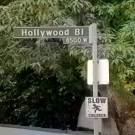
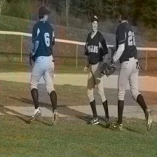
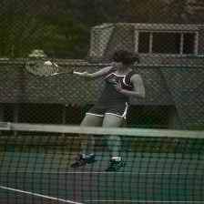

# Image Colorization

### Auto-Colorization of Grayscale Images with Deep Learning

> deep-learning computer-vision cnn encoder-decoder autoencoder efficientnet keras tensorflow

This is an implementation of the autoencoder for image colorization. 

I have chosen to represent images in the L-ab color space, where the L channel is for lightness and the AB channels for color. The model takes the L channel as input and attempts to predict the ab channel, which is then concatenated with the L channel to form the colored image.

---
### Model

---
### Training
The model is trained with transfer learning - the encoder part of the model is an already pretrained [EfficientNet](https://keras.io/api/applications/efficientnet/#efficientnetb0-function). 
With a learning rate of 1e-3, the model can take about 100 epochs to yield decent outputs.

---
### Results
Below are some of the outputs after 100 epochs of training.

>  | 

>  | 

>  | 

>  | 

>  | 

>  | 

---
### Possible Architectural Improvements

- Train the pretrained encoder further alongside the decoder in order for it to learn this specific domain and dataset.

- Use another encoder alongside the pretrained encoder and merge their features together before feeding them to the decoder.

- Use a UNet, a similar model where layers in the encoder are connected to corresponding layers in the decoder.

